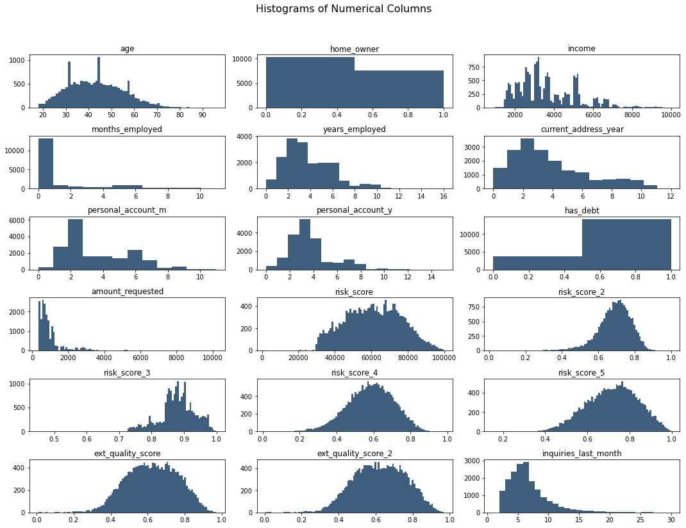
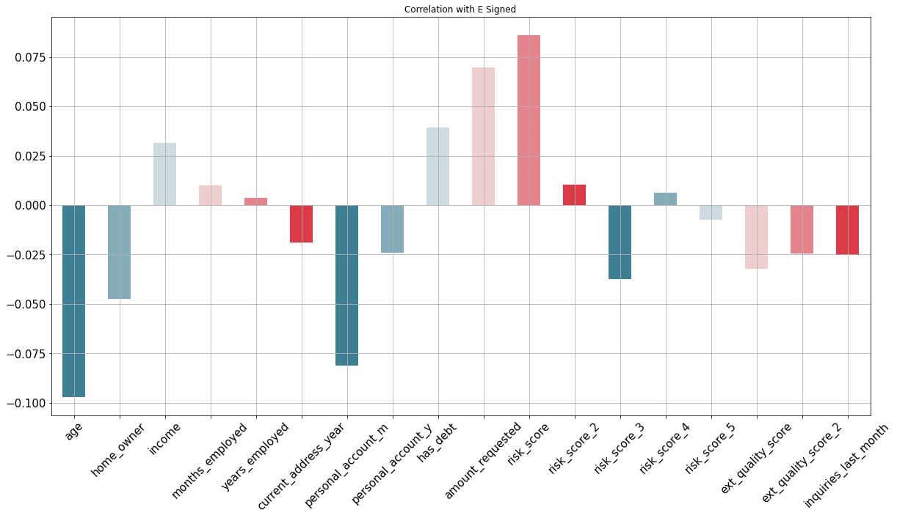
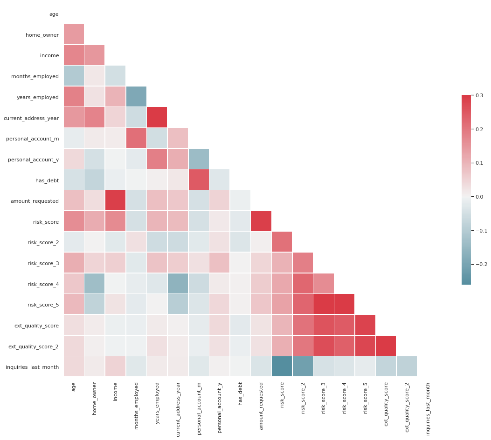

# eSigning Classification
This repo consists of the eSigning Classification Case Study from Super Data Science's course, Machine Learning Practical: 6 Real-World Applications.

## Problem Statement
The objective of this Case Study is to develop a model to predict for **Quality** Applicants. In this case study, **Quality** Applicants are those who reach a Key Part of the Loan Application Process.

## Model Used
The case study utilises Logistic Regression Model from the Scikit Learn Library, which is evaluated a number of Metrics like Accuracy Score, Precision Score, F1 Score, Recall Score and many more. Also, we try different models such as SVM (both with *Linear* and *RBF* Kernel) and Random Forest Model, to compare the different Models. The Best Model among them is later improved, using 2 different rounds of Grid Search.

## Libraries Used
- Pandas
- Numpy
- Matplotlib
- Seaborn
- Scikit Learn

## Visualisation of the data
*The following plot (Matplotlib Subplots) shows Histograms of the Features from the entire Dataset*
 
 

## Correlation with Response Variable
*The following plot (Pandas Bar Plot) shows a measure of the Correlation of the features, with the Response Variable (Churn Likelihood of the User)*
 
 

## Correlation Among the Features
*The following plot (Seaborn Heatmap) shows the Correlation among the Features, with each other*
 
 
